# 🎯 DBSCAN Interactive Visualization Platform

An interactive educational web application designed to **demystify the DBSCAN clustering algorithm** through profession-specific visualizations, real-time parameter controls, and practical use cases. Perfect for real estate professionals, lawyers, journalists, and anyone wanting to understand data clustering without technical jargon.

---

## 📖 What Does It Do?

This application transforms complex machine learning concepts into accessible, profession-specific learning experiences. It teaches DBSCAN (Density-Based Spatial Clustering of Applications with Noise) through interactive visualizations and real-world scenarios tailored to:

- **Real Estate Professionals** - Group properties, find undervalued listings, understand market segments
- **Legal Professionals** - Organize case databases, find precedents, identify landmark cases
- **Journalists** - Organize coverage, spot story patterns, discover investigative angles

The platform provides an intuitive step-by-step journey from basic concepts to advanced parameter tuning, with live visualizations showing exactly how the algorithm works.

---

## ✨ Features

### 🏠 **Welcome Page**
- Choose your profession (Real Estate, Law, or Journalism)
- See personalized examples relevant to your field
- Understand why clustering matters for your work

### 📚 **Learn the Language**
- Translates technical ML terms into profession-specific vocabulary
- Side-by-side comparison of "your language" vs "tech language"
- Contextual explanations with real-world examples
- No jargon, just clear explanations

### 🎓 **Interactive Tutorial**
- **Step 1**: Visualize your data points
- **Step 2**: Understand the epsilon (ε) distance parameter
- **Step 3**: Learn about minimum points (minPts) requirement
- **Step 4**: Watch clusters form automatically
- **Step 5**: Identify and interpret outliers
- Smooth D3.js animations showing cluster formation
- Color-coded legend with animated transitions
- Profession-specific axis labels and tooltips

### 🎮 **Live Clustering Playground**
- Interactive canvas for adding/removing data points
- Real-time DBSCAN algorithm visualization
- Adjustable parameters (epsilon and minPts) with instant feedback
- Animation speed control for step-by-step learning
- Visual epsilon radius and neighbor highlighting
- Statistics dashboard showing clusters, noise points, and progress
- Legend showing point types (core, border, noise, current)

### 🔄 **Compare Scenarios**
- Three preset configurations:
  - **Loose Grouping**: Broad overview, wide epsilon
  - **Balanced**: Standard approach for daily work
  - **Strict Grouping**: Precise matching, tight clusters
- Custom parameter experimentation mode
- Side-by-side visualizations with realistic datasets
- Export clustering results to CSV
- Profession-specific use case recommendations
- FAQ section and important technical notes

### 💡 **Professional Insights**
- Real-world case studies for each profession
- Before/after problem-solution scenarios
- Quantified results and metrics
- Professional testimonials
- Expert tips and best practices
- Practical implementation guidance

---

## 🛠️ Tech Stack

| Technology | Version | Purpose |
|-----------|---------|---------|
| **React** | 19.1.1 | Component-based UI framework |
| **Vite** | 7.1.7 | Lightning-fast build tool and dev server |
| **D3.js** | 7.9.0 | Data visualization and animations |
| **Tailwind CSS** | 4.1.17 | Utility-first styling framework |
| **Framer Motion** | 12.23.24 | Smooth animations and transitions |
| **Lucide React** | 0.548.0 | Beautiful icon library |
| **density-clustering** | 1.3.0 | DBSCAN algorithm implementation |

### Development Tools
- **ESLint** - Code quality and consistency
- **Babel React Compiler** - Optimized React builds
- **@vitejs/plugin-react** - Fast refresh and JSX support

---

## 📦 Installation & Setup

### Prerequisites
Make sure you have the following installed:
- **Node.js** (v18 or higher)
- **npm** or **yarn**

### 1️⃣ Clone the Repository
```bash
git clone https://github.com/yourusername/DHV_DBSCAN.git
cd DHV_DBSCAN
```

### 2️⃣ Install Dependencies
```bash
npm install
```
or
```bash
yarn install
```

### 3️⃣ Run Development Server
```bash
npm run dev
```
or
```bash
yarn dev
```

### 4️⃣ Open in Browser
Navigate to: **http://localhost:5173/**

### 5️⃣ Build for Production
```bash
npm run build
```
or
```bash
yarn build
```

### 6️⃣ Preview Production Build
```bash
npm run preview
```

---

## 🖼️ UI Preview Screenshots

### 1. Welcome Page
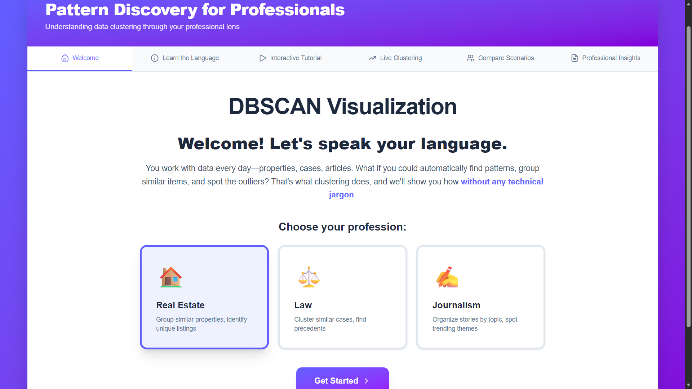
*Choose your profession (Real Estate, Law, or Journalism) to get personalized examples and start your learning journey*

---

### 2. Learn the Language

<div align="center">

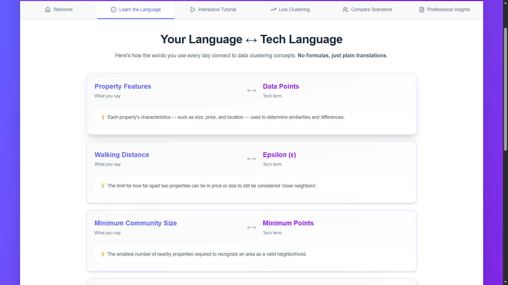
*Professional terminology translated into tech terms - No jargon, just clear explanations*

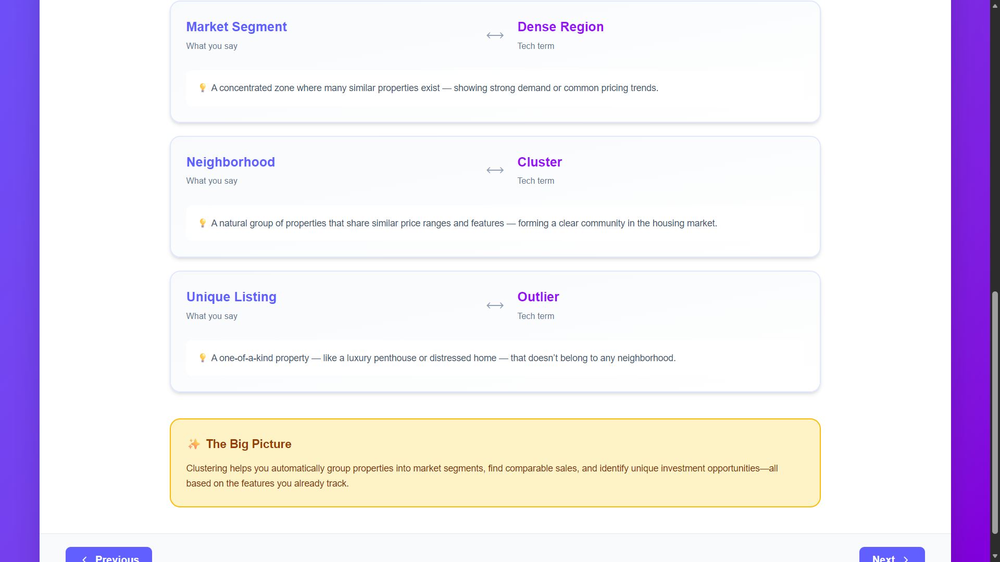
*Side-by-side comparison showing how your daily vocabulary maps to clustering concepts*

</div>

---

### 3. Interactive Tutorial - Step by Step

<div align="center">

#### Step 1: Visualize Your Data
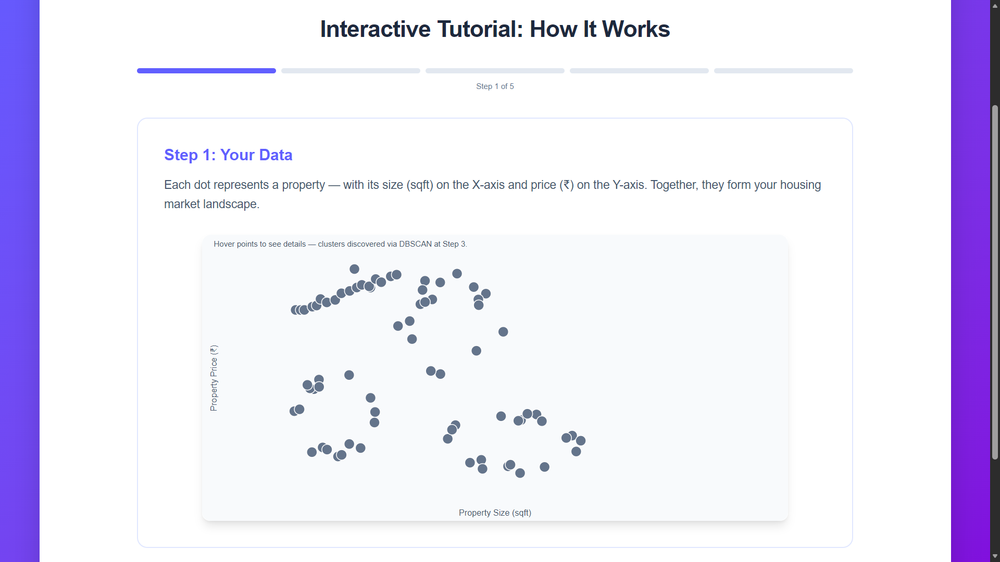
*See your data points plotted - each dot represents a property, case, or article*

#### Step 2: Set Walking Distance (Epsilon)
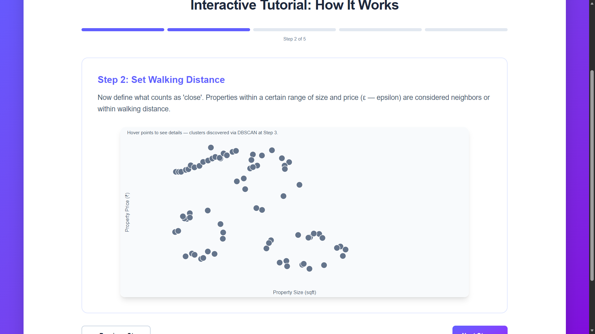
*Define how close items must be to be considered neighbors*

#### Step 3: Minimum Neighborhood (MinPts)
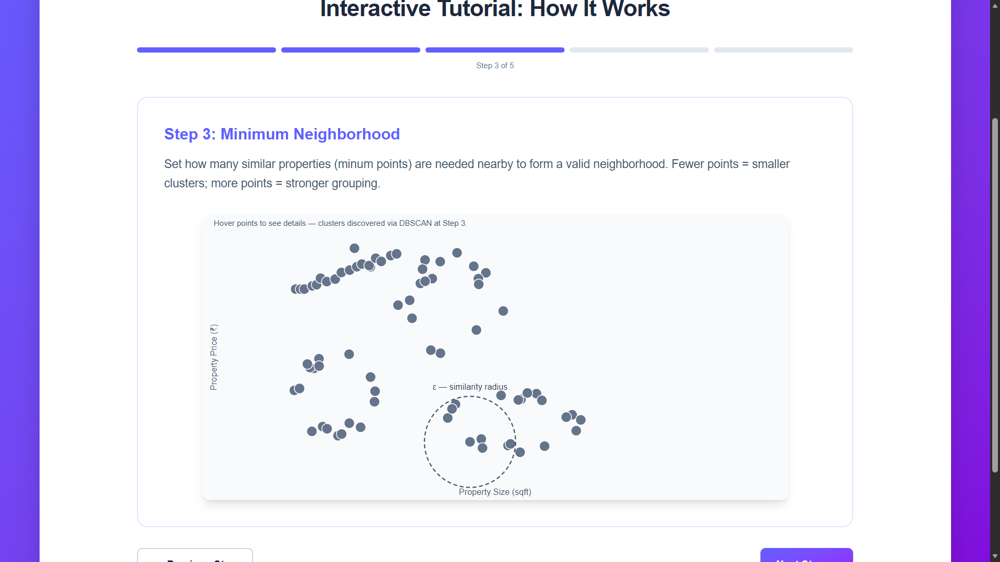
*Set how many similar items are needed to form a valid group*

#### Step 4: Watch Clusters Form

*DBSCAN automatically discovers natural groupings with color-coded clusters and legend*

#### Step 5: Identify Outliers
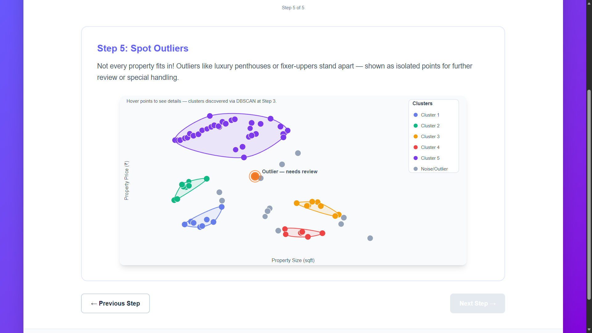
*Unique items that don't fit any cluster - highlighted for special attention*

</div>

---

### 4. Live Clustering Playground
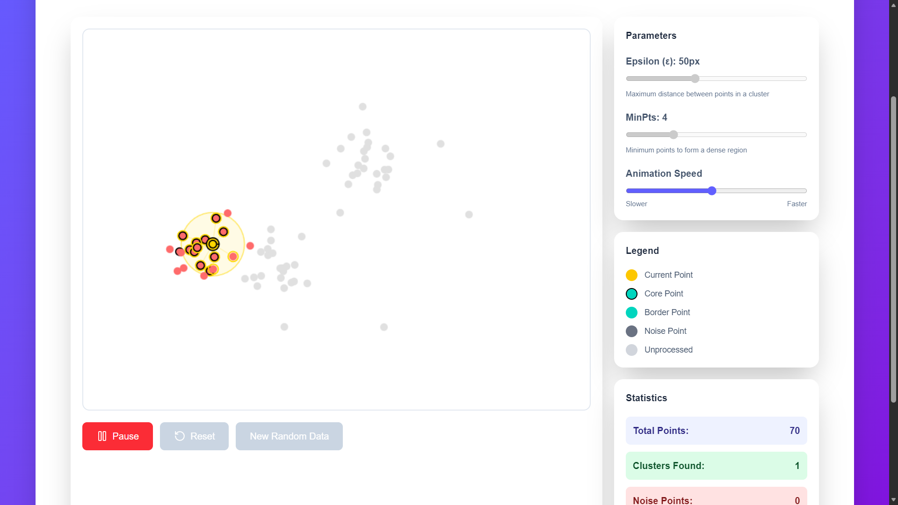
*Interactive canvas with real-time DBSCAN visualization - Click to add points, adjust parameters, and watch clusters form step-by-step*

---

### 5. Compare Scenarios

<div align="center">

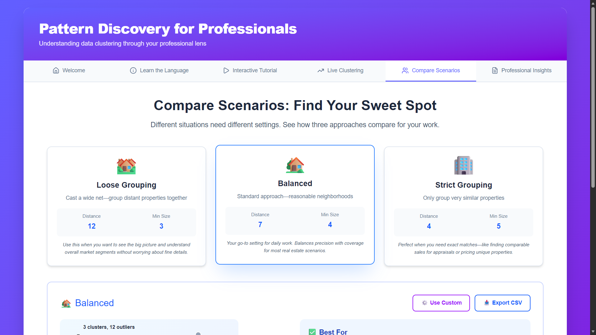
*Three preset configurations: Loose Grouping, Balanced, and Strict Grouping*

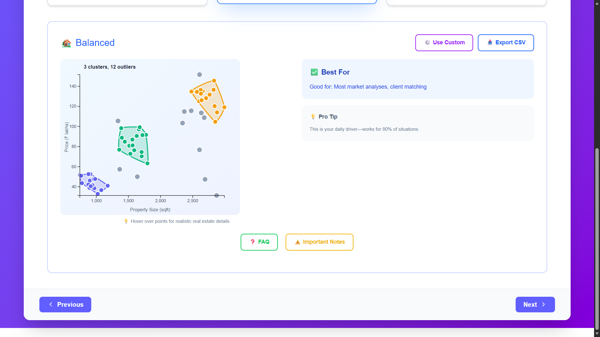
*See how different parameters affect clustering results with realistic profession-specific data*

</div>

---

### 6. Professional Insights

<div align="center">


*Real-world case study: Finding Hidden Investment Gems in Real Estate*

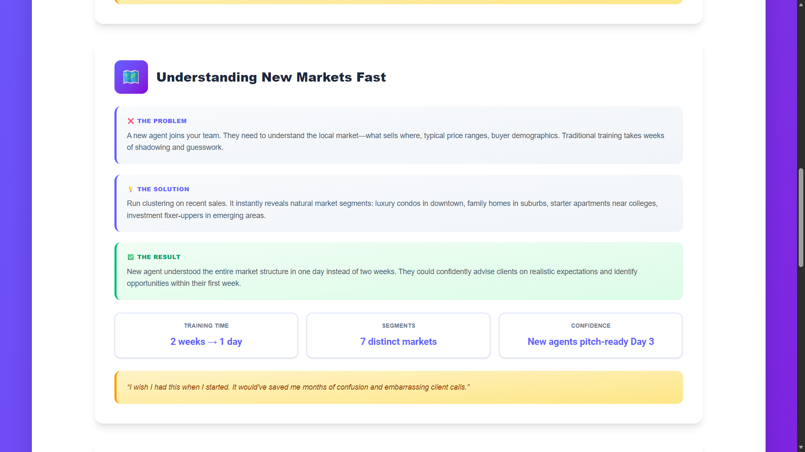
*Before/After scenarios showing tangible results and ROI metrics*

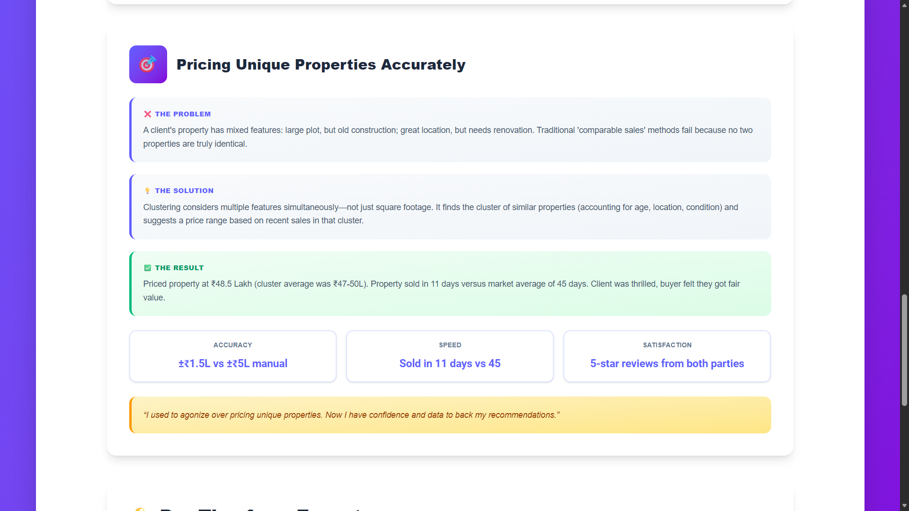
*Comprehensive case studies with quantified results for each profession*

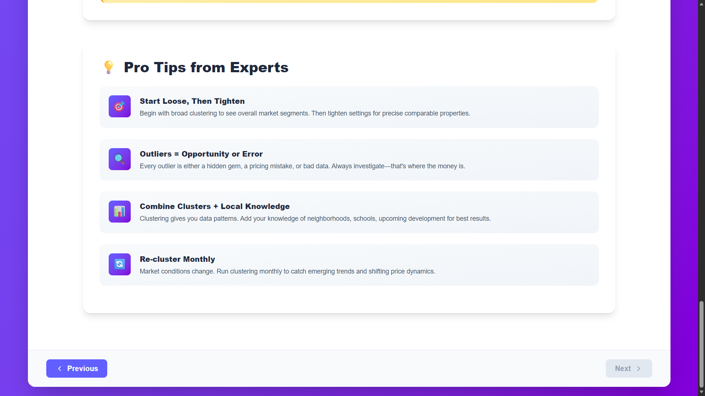
*Pro tips and best practices from industry experts*

</div>

---

> **📸 Screenshot Information:**
> - All screenshots are taken from the live application
> - Images show the application running with Real Estate profession selected
> - Interactive features and animations are visible in actual use
> - Screenshots are stored in `./screenshots/` folder

---

## 📂 Project Structure

```
DHV_DBSCAN/
├── src/
│   ├── components/
│   │   ├── WelcomePage.jsx           # Profession selection
│   │   ├── LearnLanguagePage.jsx     # Terminology translation
│   │   ├── InteractiveTutorialPage.jsx # Step-by-step guide
│   │   ├── TutorialVisual.jsx        # D3.js visualization component
│   │   ├── LiveClusteringPage.jsx    # Interactive playground
│   │   ├── CompareScenario.jsx       # Scenario comparison
│   │   ├── InsightsPage.jsx          # Professional case studies
│   │   └── export.js                 # Component exports
│   ├── App.jsx                       # Main application component
│   ├── main.jsx                      # Application entry point
│   └── index.css                     # Global styles
├── public/                           # Static assets
├── index.html                        # HTML template
├── package.json                      # Dependencies and scripts
├── vite.config.js                    # Vite configuration
├── eslint.config.js                  # ESLint configuration
└── README.md                         # This file
```

---

## 🎯 Key Components

### TutorialVisual.jsx
- Implements DBSCAN algorithm from scratch
- D3.js visualizations with smooth animations
- Dynamic cluster hulls using polygon calculations
- Interactive tooltips with profession-specific data
- Legend system to avoid text overlap
- Responsive design with proper scaling

### LiveClusteringPage.jsx
- Real-time DBSCAN animation
- Point-by-point cluster expansion visualization
- Canvas-based rendering for performance
- Interactive point addition/removal
- Statistics tracking and display
- Animation speed control

### CompareScenario.jsx
- Multiple scenario configurations
- Realistic dataset generation
- CSV export functionality
- Custom parameter experimentation
- Visual comparison tools

---

## 🎓 How It Works

### DBSCAN Algorithm Implementation
The application implements DBSCAN (Density-Based Spatial Clustering of Applications with Noise) with two key parameters:

1. **Epsilon (ε)**: Maximum distance between points to be considered neighbors
2. **MinPts**: Minimum points required to form a dense region

**Algorithm Steps:**
1. For each unvisited point, find all neighbors within epsilon distance
2. If neighbors ≥ minPts, start a new cluster
3. Recursively add neighbors' neighbors to the cluster
4. Points with insufficient neighbors are marked as noise/outliers
5. Continue until all points are visited

**Point Classification:**
- **Core Points**: Have ≥ minPts neighbors (shown with bold border)
- **Border Points**: Within epsilon of core points but have < minPts neighbors
- **Noise Points**: Not within epsilon of any core point (shown in gray)

---

## 🚀 Use Cases by Profession

### 🏠 Real Estate
- Group similar properties for market analysis
- Identify undervalued listings (outliers below cluster pricing)
- Find comparable sales for accurate pricing
- Understand market segments and buyer demographics
- Detect data entry errors in property listings

### ⚖️ Law
- Organize case databases by type and complexity
- Find relevant precedents instantly
- Identify landmark cases requiring senior review
- Balance workload across attorneys
- Data-driven settlement strategy

### ✍️ Journalism
- Organize coverage by beats and topics
- Identify coverage gaps in real-time
- Discover investigative series opportunities
- Archive organization and content discovery
- Find original stories worth featuring

---

## 🔧 Configuration

### Vite Configuration
The project uses Vite for fast development and optimized production builds. Configuration includes:
- React plugin for fast refresh
- Tailwind CSS integration
- Optimized chunk splitting for better caching

### ESLint Configuration
Code quality is maintained through ESLint with:
- React Hooks rules
- React Refresh rules
- Modern JavaScript globals

---

## 🤝 Contributing

Contributions are welcome! Please feel free to submit a Pull Request.

1. Fork the repository
2. Create your feature branch (`git checkout -b feature/AmazingFeature`)
3. Commit your changes (`git commit -m 'Add some AmazingFeature'`)
4. Push to the branch (`git push origin feature/AmazingFeature`)
5. Open a Pull Request

---

## 📝 License

This project is open source and available for educational purposes.

---

## 🙏 Acknowledgments

- D3.js community for amazing visualization library
- React team for the robust framework
- Tailwind CSS for the utility-first approach
- All contributors who helped improve this educational tool

---

## 📧 Contact

For questions, suggestions, or feedback, please open an issue on GitHub.

---

**Made with ❤️ for learners who want to understand data clustering without the complexity**